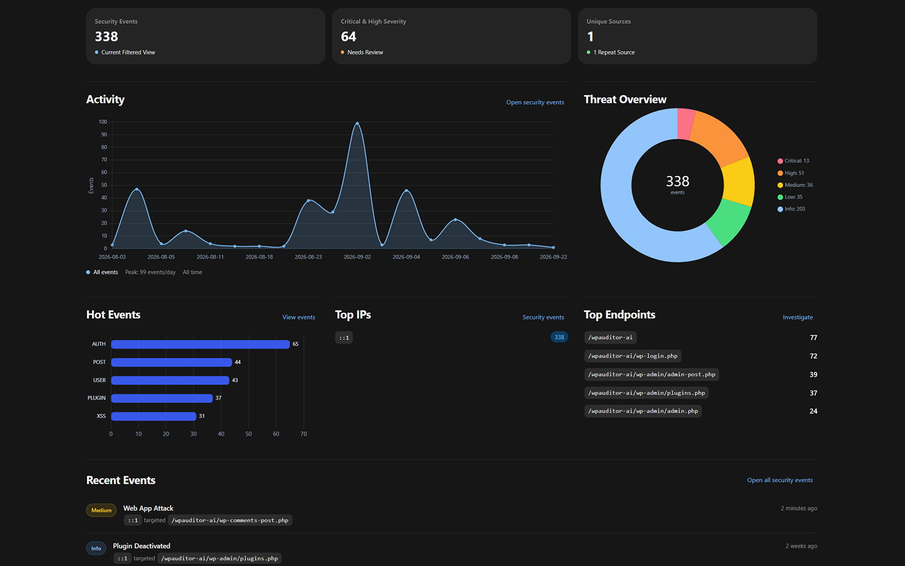
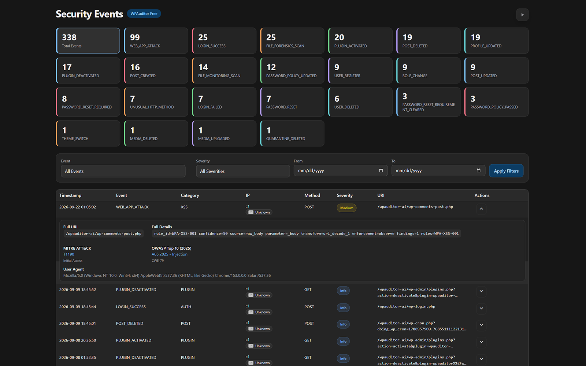
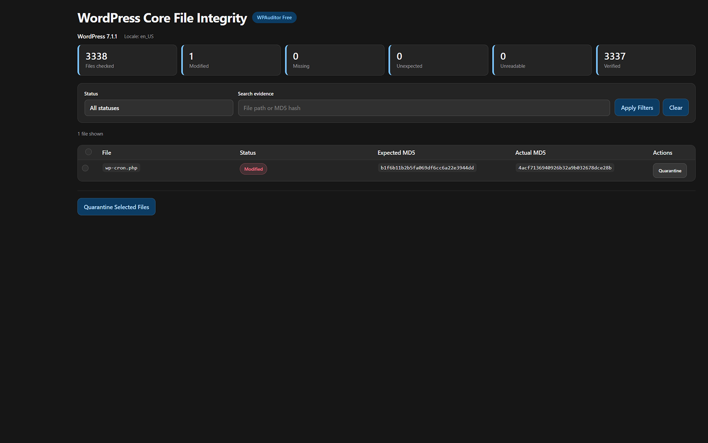
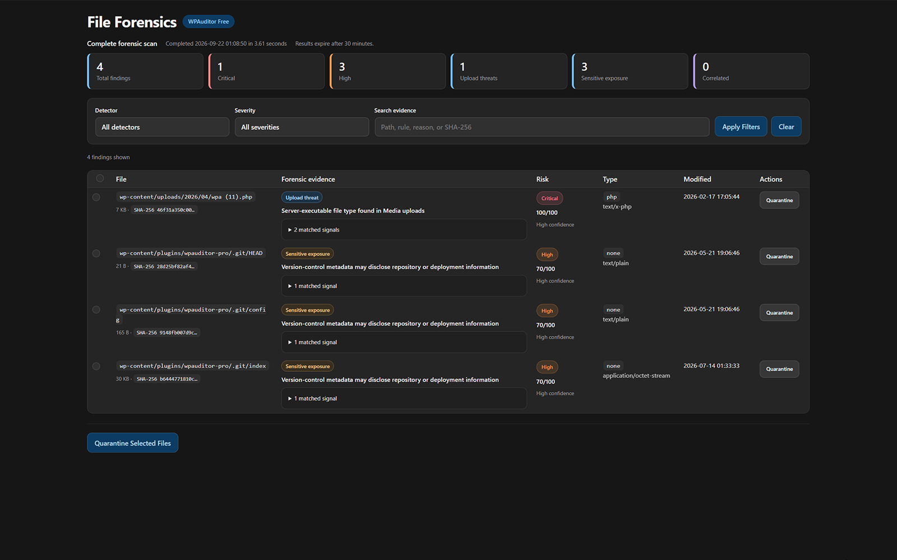
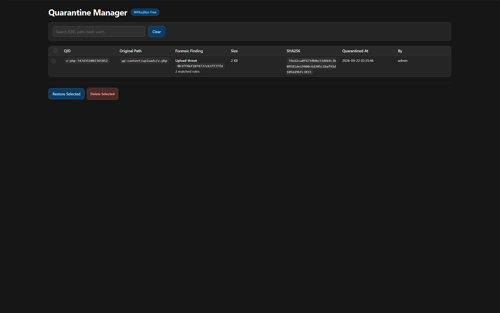
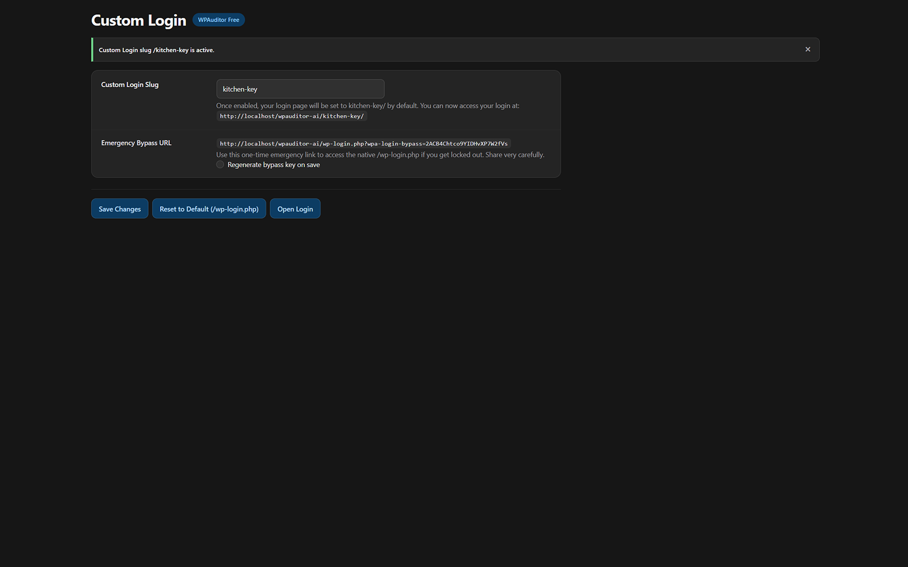
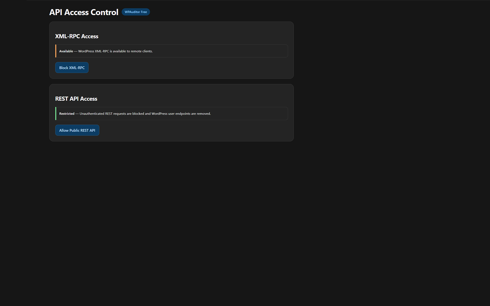

  

<h1 align="center">WPAuditor</h1>

<strong>The security visibility layer for WordPress.</strong>

  Open-source activity logging, request threat detection, core file integrity,
  file forensics, quarantine, and access hardening for WordPress.

  
  
  
  

  <a href="https://wpauditor.app">Website</a> ·
  <a href="https://wpauditor.app/documentation.html">Documentation</a> ·
  <a href="https://github.com/WPAuditor/WPAuditor/releases/latest">Download Free</a> ·
  <a href="https://wpauditor.app/plans.html">Get Pro</a> ·
  <a href="SECURITY.md">Security policy</a>

---

## WordPress security visibility in one dashboard

This repository contains **WPAuditor Free**, the open-source WordPress security plugin. It helps administrators understand what is happening on a site by recording important activity locally, highlighting suspicious requests, verifying WordPress core files, investigating potentially unsafe files, and providing controlled response and hardening tools.

WPAuditor Free works without an account, license key, telemetry service, or external security dashboard. **WPAuditor Pro** is available separately for users who need the additional capabilities described on the [plans page](https://wpauditor.app/plans.html). The Free and Pro editions cannot run at the same time; deactivate one edition before activating the other.

## Features

| Area | Included capabilities |
| --- | --- |
| **Security dashboard** | Event, severity, source-address, threat-category, and targeted-endpoint summaries with time and severity filters. |
| **Activity and audit log** | Successful and failed logins, user and role changes, content and media activity, plugin activation or deactivation, and theme changes. |
| **Request threat detection** | Indicators associated with SQL injection, cross-site scripting, command injection, remote code execution, file inclusion and path traversal, PHP object injection, XXE, suspicious uploads, sensitive-file probes, reconnaissance, and encoded payloads. |
| **Core file integrity** | Administrator-initiated comparison of WordPress core files with official WordPress.org checksums. |
| **File Forensics** | Inspects files for suspicious characteristics and presents risk, confidence, evidence, hashes, file types, and modification context when available. |
| **Quarantine Manager** | Isolates reviewed files and supports controlled restoration or permanent deletion. |
| **Access hardening** | Optional Custom Login, XML-RPC blocking, REST API restrictions, and public-user-endpoint controls. |
| **Log management** | Log health, downloads, manual cleanup, and configurable automatic retention from 30 to 180 days. |

> [!IMPORTANT]
> WPAuditor reports indicators for administrator review. A detection is not proof of compromise, and the free edition does not automatically block attacking IP addresses. Back up your site and verify recovery access before quarantining files or enabling hardening controls.

## Screenshots

### Security dashboard

| Security Events | WordPress Core File Integrity |
| --- | --- |
|  |  |

| File Forensics | Quarantine Manager |
| --- | --- |
|  |  |

| Custom Login | API Access Control |
| --- | --- |
|  |  |

## Requirements

- WordPress 6.0 or later
- PHP 8.0 or later
- Write access to the WordPress content and uploads locations used for protected log and quarantine storage
- Working WordPress scheduled events for automatic log retention
- Outbound HTTPS access to WordPress.org for administrator-initiated core checksum scans
- Outbound HTTPS access to GitHub for release checks and plugin updates

## Installation

### From a GitHub release

1. Open the [latest release](https://github.com/WPAuditor/WPAuditor/releases/latest).
2. Download the attached `wpauditor.zip` package. Do not use GitHub's automatically generated source archive as the WordPress installer package.
3. In WordPress, open **Plugins → Add New Plugin → Upload Plugin**.
4. Select `wpauditor.zip`, install it, and activate **WPAuditor**.
5. Open **WPAuditor → Settings** and verify logging, retention, and timezone preferences.
6. Review the dashboard and run File Forensics and Core Integrity before enabling optional hardening controls.

### Updates

Starting with version 1.0.1, the GitHub-distributed edition checks WPAuditor's latest stable GitHub release and shows a normal WordPress update notice when a newer version and an attached `wpauditor.zip` are available. Site administrators can update from the Plugins screen or enable WordPress automatic updates. GitHub's generated source archives are not used for plugin updates.

Version 1.0.0 does not contain this updater. Sites running 1.0.0 must install version 1.0.1 once using the ZIP upload steps above. Future releases must include a `wpauditor.zip` whose root is `wpauditor/` and whose `wpauditor.php` version matches the release tag.

## What does WPAuditor monitor?

WPAuditor records supported WordPress authentication, account, role, content, media, plugin, and theme events. It also analyzes supported request components for suspicious patterns and provides severity, confidence, HTTP, OWASP, and MITRE ATT&CK context where available.

## Does WPAuditor block attacks?

The free edition observes and records supported suspicious activity for review. It does not automatically block source IP addresses. Detection results can include false positives and should be investigated alongside server logs, account activity, file changes, and the actual request outcome.

## Where is information stored?

Events are stored locally in protected storage within the WordPress content area. WPAuditor Free does not send event logs to WPAuditor. Logs can contain personal or confidential information, so administrators should use appropriate retention periods and protect exported copies.

Recognized password-like URL parameters, tokens, nonces, API keys, secrets, and Custom Login recovery values are redacted before logging. Arbitrary application data may still contain sensitive information and should be reviewed before sharing.

## External service

WPAuditor contacts the official WordPress.org Core Checksum API only when an authorized administrator starts a Core File Integrity scan. The request contains the installed WordPress version and locale. Site content, WPAuditor logs, and user data are not included.

- Service: `https://api.wordpress.org/core/checksums/1.0/`
- [WordPress.org privacy policy](https://wordpress.org/about/privacy/)

The GitHub-distributed edition also requests the latest public release information from `https://api.github.com/repos/WPAuditor/WPAuditor/releases/latest` during WordPress update checks. When an update is installed, WordPress downloads the attached ZIP from GitHub. GitHub receives ordinary connection information such as the server IP address and HTTP headers. WPAuditor does not send event logs, scan findings, license keys, or account data with these requests.

The free edition does not include analytics, telemetry, advertising, license callbacks, AI-provider connections, or Cloudflare synchronization.

## Responsible use

- Confirm findings before deleting or quarantining files.
- Keep tested off-site backups and a working recovery path.
- Test Custom Login and API restrictions on staging or in a private browser session before signing out.
- Restrict WPAuditor access to trusted administrators.
- Review and redact exported logs before sharing them.

## Security reports

Please do not disclose suspected vulnerabilities in a public issue. Follow the private reporting process in [`SECURITY.md`](SECURITY.md).

## Support and contributions

Use [GitHub Issues](https://github.com/WPAuditor/WPAuditor/issues) for reproducible bugs and feature requests that do not contain sensitive security information. Include the WPAuditor version, WordPress version, PHP version, relevant steps, and sanitized diagnostic details.

Contributions should be focused, documented, and compatible with the WordPress coding and security practices used by the project. A dedicated contribution guide may be added as the public development workflow grows.

## Third-party components

- [Chart.js 4.5.1](https://github.com/chartjs/Chart.js/releases/tag/v4.5.1), distributed under the MIT License.
- Country flag images from [Flagpedia](https://flagpedia.net/download), published for commercial and non-commercial use as public-domain material according to the source.

## License

WPAuditor is licensed under the [GNU General Public License v2.0 or later](LICENSE.txt).

WPAuditor is independently developed and is not affiliated with or endorsed by WordPress, WordPress.org, Automattic, or the WordPress Foundation. WordPress is a registered trademark of the WordPress Foundation.
